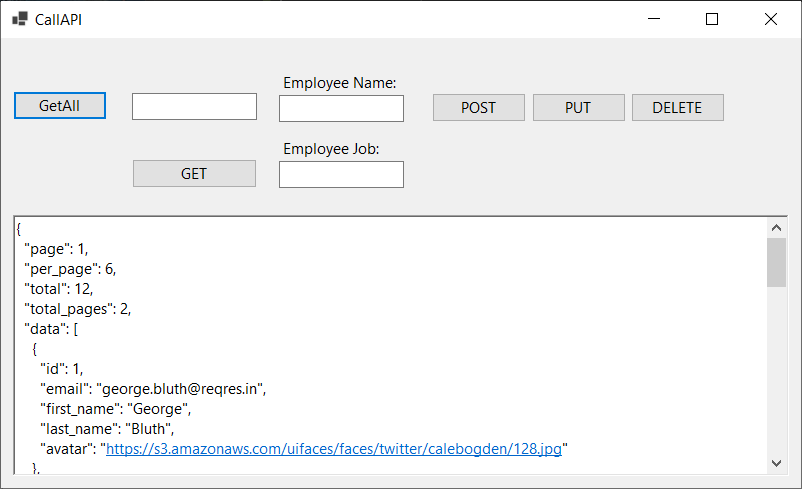

# WFA-LOGIN-API
DotNetCore Winforms App (Desktop application) - Consuming Restful API Services. 

Allows user to login and make calls to the restful API at https://reqres.in/

- Login
- GET, POST, PUT & DELETE employee's

Invalid Login Example:
Successful Login Example:
Get All Employee's:
Delete Employee:
Get Single Emplyee:
Post (Create) Employee:
Put (Update) Employee:
